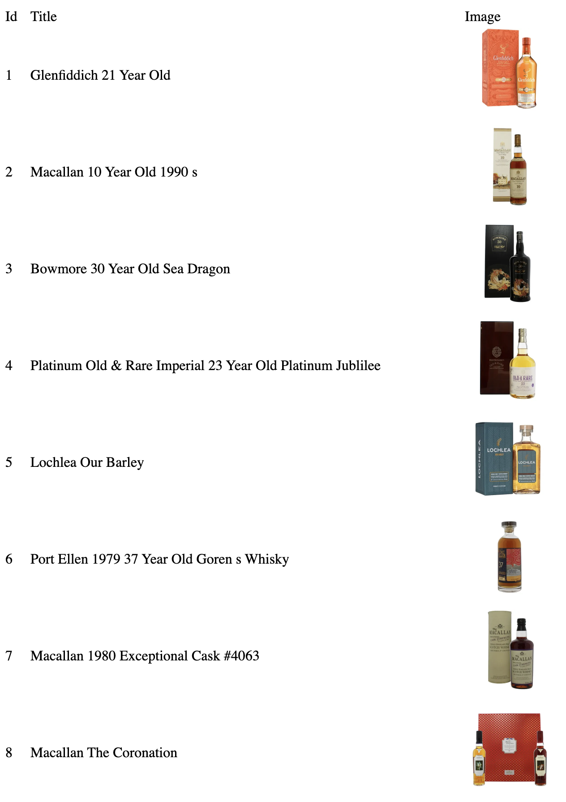

# Lux Project Python Web Scraper

This is a python web scraper proof of concept in docker using Postgres to store the scraped data then retreive the data from the database, create a simple html page and display the data at `localhost:8080`. Currently the scraper works for whiskyshop.com and it scrapes the first 200 item names and images, but for future versions it is expected to be generalized to scrape text from a broader variety of websites and store text data into the database. 

Using Doxygen for documentation, see the index.html file in the /html folder.

## Setup

1. To run this project first make sure you have docker installed.
2. Clone this repository.
3. Navigate to the docker folder enclosed in the cloned file.
4. Run the `docker-compose up` command.
5. Make sure the container is running and displays this message `backend exited with code 0`.
6. Navigate to `localhost:8080` in your browser.

You should now see the whiskyshop items displayed like what is shown here:

